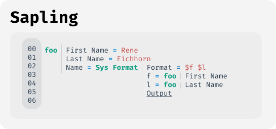

### Philosophy

Sapling is a programming system focusing on scalability and simplicity. We truly believe that programming should be accessible to everyone, regardless of their background or experience level.

* **Data first**: In Sapling **everything** is data everything follows the same data model, and with everything we mean everything hence computation / code is included as well.
* **Immutability**: Mutability is the root of many problems and hence in Sapling data is conceptually never destroyed or modified.
* **Cognitive scalability**: Whether human or machine, the amount of cognitive load we can handle is limited. Sapling is designed to reduce the required context to the minimum during development.
* **First class debuggability**: Debugging is just as important as the rest of the programming system. In Sapling all data can be visualized and inspected at any point in time through various tools and interfaces.
* **Performance is secondary**: We accept that Sapling is very high level and we don't push limitations of hardware on to the design or philosophy of Sapling to make it faster and push performance worries down to the execution engine.

### Core concept

In Sapling there is only one core concept: **data**. This data is represented in a simple data model. Every piece of information is stored as a so called `Fact`. A fact has the following properties:
* **Subject**: The target of the information to be stored.
* **Property**: A characteristic of the subject.
* **Value**: The value of the property.
* **Operator**: The operation to be performed on the property.
* **Meta**: Additional metadata about the fact such as date, source, creator, access rights, ...

While there is no pure human readable text representation of a fact, it can represented in the following notation:
```
<subject>/<property> <operator> <value> <meta>

person1/name = "Rene Eichhorn"  #PERSONAL_DATA
person1/age  = 31               #PERSONAL_DATA

query/name == *
```

### Code as data

As written above everything in Sapling follows the same data model and this includes code. Precisely there is no "code" per se in Sapling, but rather what we call `computationals` which essentially refers to data which is evaluated / computed through algorithms that may or may not depend on data.
This is a key design choice of Sapling as it removes the need to think about code structure, project structures, folders and abstractions. In large projects it keep the complexity of the codebase low and instead requiring the user to understand the system they simple ask for the relevant code of their choice.

Instead of going through files and tracing through functions to reach your final destination, in Sapling you simply "query" / ask for the relevant code of your choice.
* Show me how the value of this label in the UI is computed.
* Show me what happens if I click on this button.
* What happens if some data in a given shape is created?
* What transforms my data A to B?
